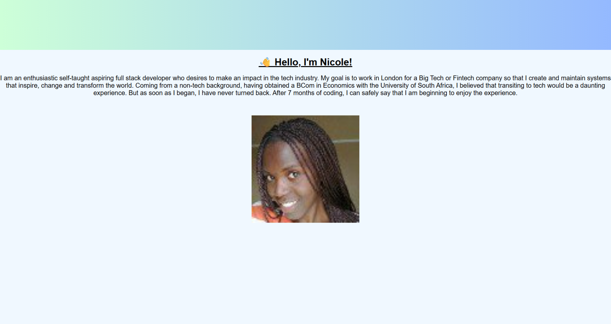

Here’s a clean, beginner-friendly **README.md** you can copy straight into your GitHub project:

---

# 🌐 Personal Introduction Page

This is a simple beginner-level HTML project that displays a personal introduction with a heading, paragraph, and image. The goal of this project is to practice basic HTML structure and inline CSS styling while creating a clean and readable webpage.

---
## 📸 Screenshot



---

## 📄 Project Overview

The page includes:

* A main heading introducing the author
* A short personal introduction paragraph
* A centred image styled with basic CSS
* Styling using internal `<style>` tags
* A simple and clean layout suitable for HTML beginners

This project is part of my early web development practice as I build foundational skills in **HTML** and **CSS**.

---

## 🧰 Technologies Used

* **HTML5**
* **CSS3 (Internal Stylesheet)**

---

## 📁 Folder Structure

```
project-folder/
│
├── index.html
└── Images/
    └── Nix.jpg
```

## 🚀 How to View the Page

You can open the project by:

1. Downloading or cloning this repository
2. Opening `index.html` in any web browser

---

## ⭐ What I Learned

* How to structure an HTML page
* How to style text and images using internal CSS
* How to center elements using basic CSS properties
* How to link and display local images in a webpage

---

## 📌 Future Improvements

These enhancements may be added as I learn more:

* Add a navigation bar
* Include more sections (skills, hobbies, goals)
* Improve styling using external CSS
* Add responsiveness with media queries

---


